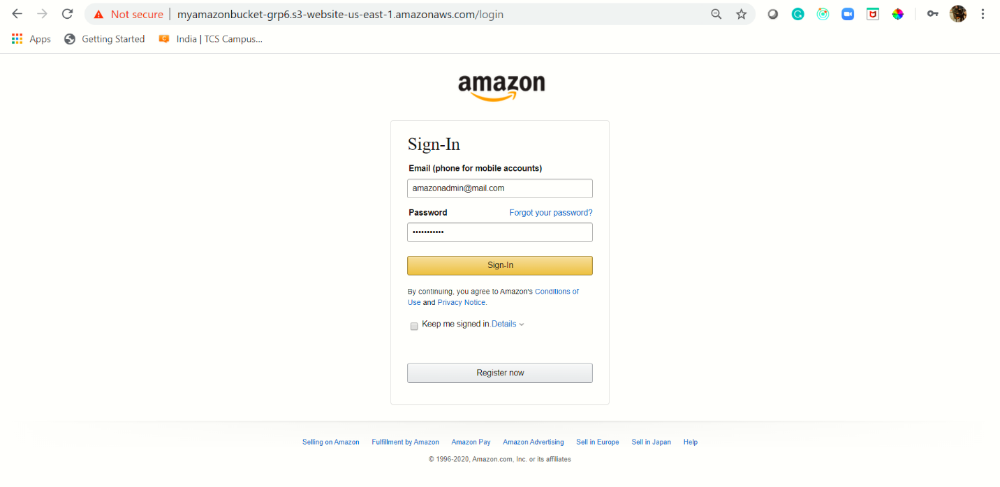
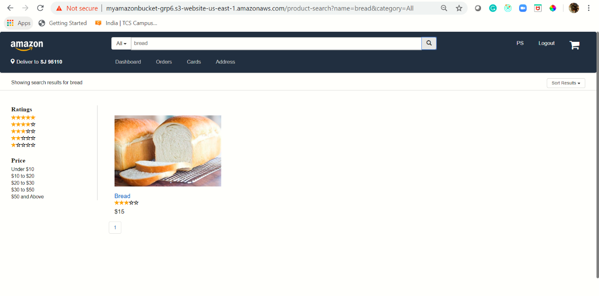
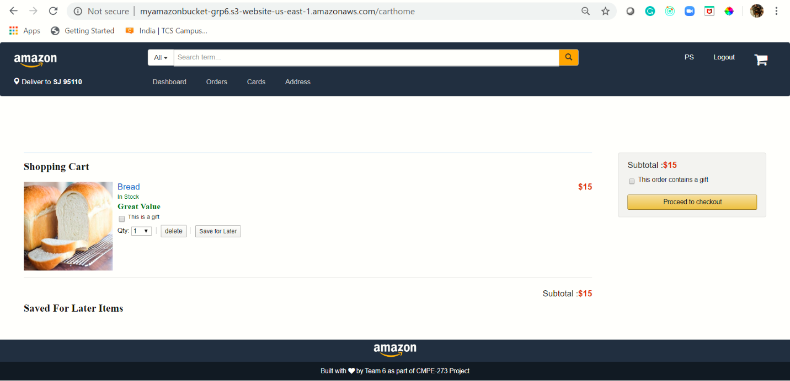
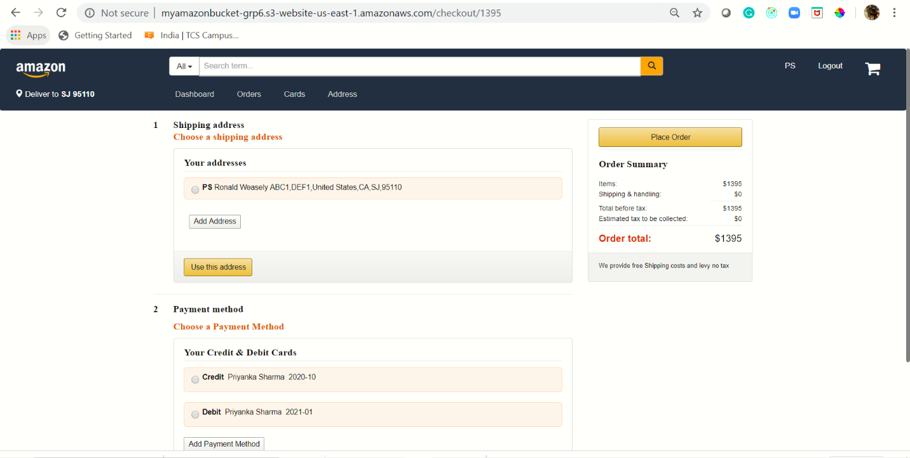
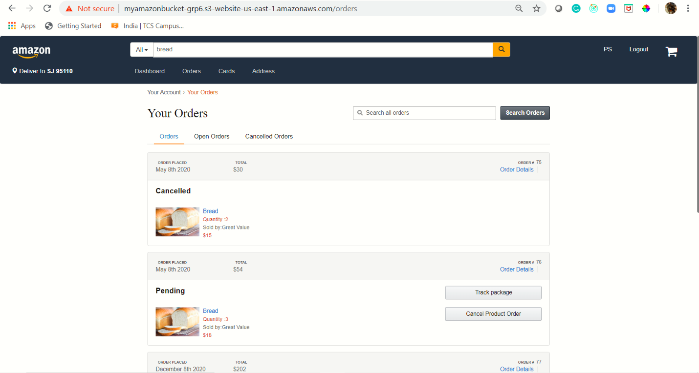
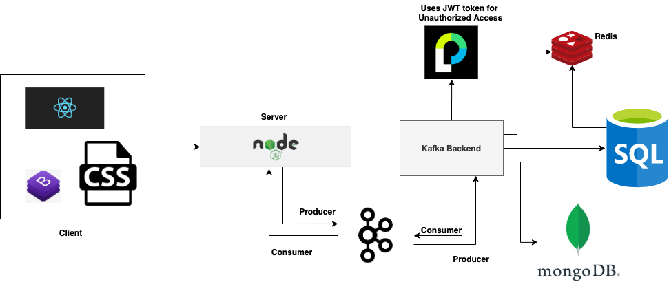
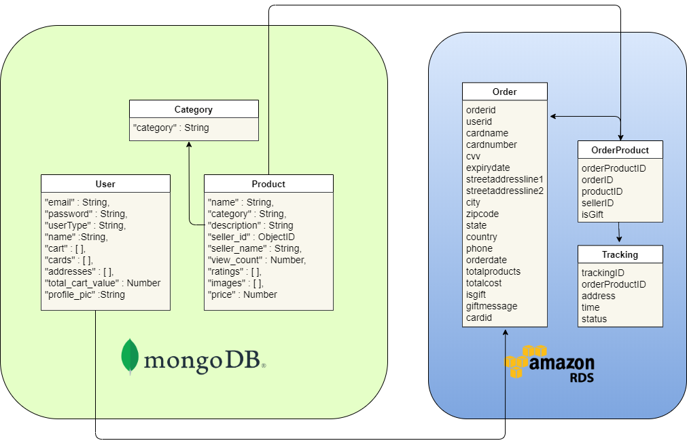
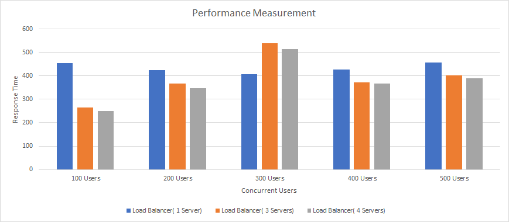

# amazon
## Key features: Multiple databases- MySQL & MongoDB ,Redis Cache, Kafka, Passport JWT Authentication.
### Screens
</img>
</img>
</img>
</img>
</img>
</img>
### System Architecture
</img>
### Database Schema
</img>
### Performance Testing

We deployed the app on AWS S3 and tested the application using Jmeter with 100,200,300,400,500 concurrent requests, the performance was as follows:

</img>

After using load balancer, the application throughput is increased and the response time is gradually decreased, and even if the users are increased, the application was able to serve all the request within shorter response time compared to the application without load balancer.

Redis Caching also provides significant improvement in performance in certain functionalities where it is used. For eg. In product search and while fetching orders. Redis provided significant improvement in response times

</img>
